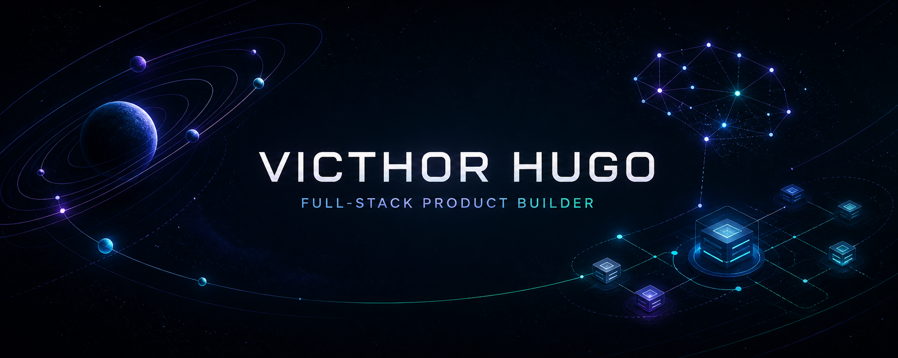

  

   

  
  
  

## Sobre mim

Sou **Victhor Hugo**, desenvolvedor full-stack focado em transformar ideias ambiciosas em produtos digitais completos. Gosto de unir engenharia, experiência do usuário e identidade visual para criar aplicações rápidas, intuitivas e prontas para crescer.

- Construo produtos SaaS, ferramentas com IA e experiências web responsivas.
- Trabalho com **Next.js, React, TypeScript, Tailwind CSS, Supabase e PostgreSQL**.
- Cuido do produto de ponta a ponta: arquitetura, interface, segurança, testes e deploy.
- Atualmente evoluindo um ecossistema de produtos autorais com foco em produtividade e inteligência.

## Projetos principais

### 🪐 Orbit — Project Operations

Workspace de operações para planejar, priorizar e executar projetos com clareza. Inclui Kanban responsivo, atalhos de teclado, busca, filtros, roadmap e uma experiência mobile completa.

### ✦ Astraea AI — Intelligent Workspace

Workspace premium de inteligência artificial com conversas persistentes, Markdown, blocos de código, autenticação segura e arquitetura multiusuário baseada em Supabase.

### ◈ Nexus — SaaS Revenue Intelligence

Plataforma SaaS multi-workspace para receita, clientes, assinaturas e crescimento. Possui demonstração pública segura, dashboards analíticos, autorização por função e isolamento de dados com RLS.

## Tecnologias

  

## GitHub em movimento

  
  

  Produtos digitais feitos com intenção, código e curiosidade.

