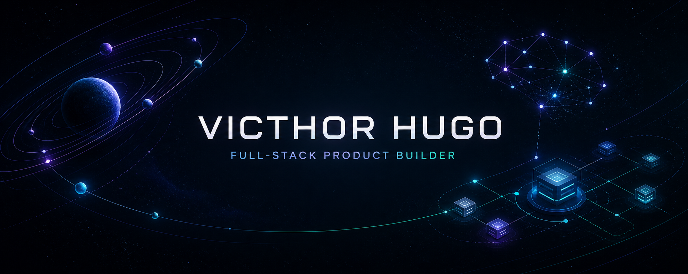
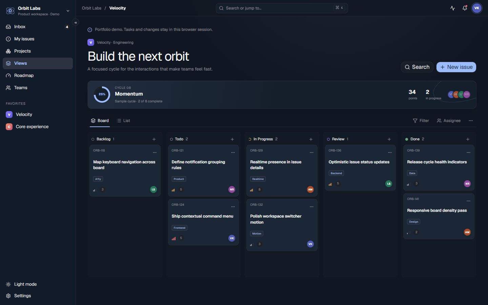
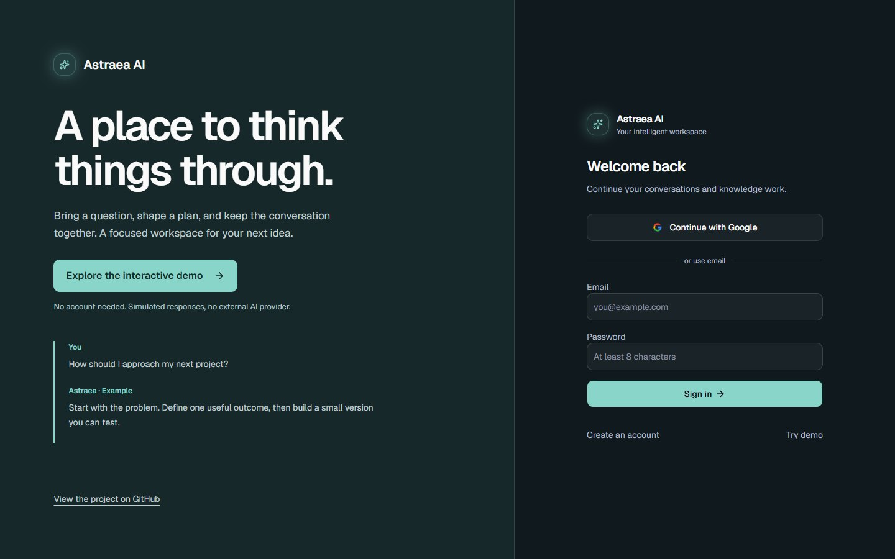
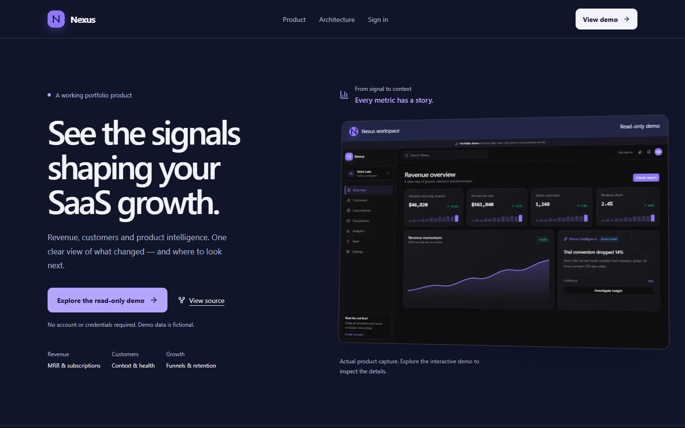
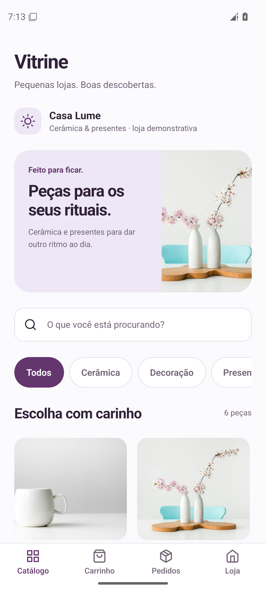

  

   

  
  
  
  

## Sobre mim

Sou **Victhor Hugo**, desenvolvedor full-stack focado em transformar ideias ambiciosas em produtos digitais completos. Gosto de unir engenharia, experiência do usuário e identidade visual para criar aplicações rápidas, intuitivas e prontas para crescer.

- Construo produtos SaaS, ferramentas com IA, experiências web responsivas e aplicativos para Android e smartphones.
- Trabalho com **Next.js, React, React Native, Expo, TypeScript, Tailwind CSS, Supabase e PostgreSQL**.
- Cuido do produto de ponta a ponta: arquitetura, interface, segurança, testes e deploy.
- Atualmente evoluindo um ecossistema de produtos autorais com foco em produtividade e inteligência.

## Projetos principais

### 🪐 Orbit — Project Operations

Workspace de operações para planejar, priorizar e executar projetos com clareza. Inclui Kanban responsivo, atalhos de teclado, busca, filtros, roadmap e uma experiência mobile completa.

Imagem do portfólio principal, capturada em 04/10/2026. Dados demonstrativos; alterações ficam nesta sessão do navegador.

### ✦ Astraea AI — Intelligent Workspace

Workspace premium de inteligência artificial com conversas persistentes, Markdown, blocos de código, autenticação segura e arquitetura multiusuário baseada em Supabase.

Imagem do portfólio principal, capturada em 04/10/2026. Demonstração com respostas simuladas, sem serviços externos de IA.

> **Next.js 16 · React 19 · TypeScript · Supabase · Tailwind CSS**  
> Autenticação SSR, conversas persistentes, Markdown, código formatado e experiência responsiva.

### ◈ Nexus — SaaS Revenue Intelligence

Plataforma SaaS multi-workspace para receita, clientes, assinaturas e crescimento. Possui demonstração pública segura, dashboards analíticos, autorização por função e isolamento de dados com RLS.

Imagem do portfólio principal, capturada em 04/10/2026. Dados fictícios, ações somente de leitura e sem acesso à produção.

### Vitrine — catálogo e pedidos para Android

App de portfólio para pequenos negócios, feito com **React Native, Expo e TypeScript**. Catálogo com fotografias locais, busca, filtros, carrinho, validação do pedido e acompanhamento simulado. Dados salvos no aparelho e funcionamento offline.

[Código e instruções](https://github.com/vitorgamer778/vitrine) · [Baixar APK demo (62 MB)](https://github.com/vitorgamer778/vitrine/releases/download/v1.0.0/vitrine-demo.apk) · [Ver no portfólio](https://programador-alpha.vercel.app/#vitrine)

Loja fictícia, sem pagamentos ou envio real de pedidos. APK de demonstração com assinatura de debug, testado offline no emulador Android API 36; não destinado à Play Store. Não inserir dados pessoais reais. [Evidências e limites](https://github.com/vitorgamer778/vitrine/blob/main/docs/validation.md).

## Tecnologias

  

  Produtos digitais feitos com intenção, código e curiosidade.

